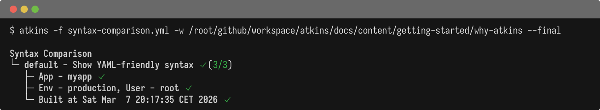
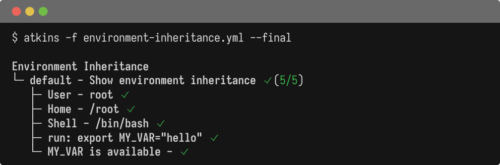
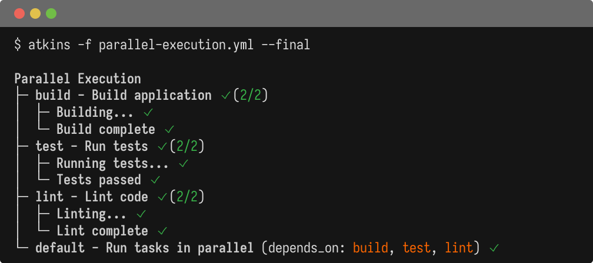

Atkins is a command runner that works the same way on your laptop and in CI. It emphasizes simplicity and YAML-friendly syntax. Atkins runs tasks locally and in automation; it does not replace GitHub Actions or other CI platforms.

## When to Choose Atkins

Atkins suits projects where:

- Commands should inherit the full shell environment automatically. Variables set in one step are available in the next without extra configuration.
- Secrets are handled externally. Atkins has no built-in secrets management; use your environment or a dedicated tool.
- YAML files shouldn't need excessive quoting. The `${{ }}` syntax works naturally in YAML and won't collide with bash `${var}` constructs.
- A small, standalone binary matters. Atkins ships as a single ~10MB binary with no runtime dependencies.
- Local and CI runs should behave identically. Write a pipeline once and run it the same way everywhere.
- Jobs run in parallel with visible progress. Use `detach: true` to run jobs concurrently; the tree view shows what's happening.
- Pipelines should be modular and reusable. Skills let you compose and conditionally activate groups of jobs across projects.

## Examples

### YAML-Friendly Syntax

The `${{ }}` syntax works naturally in YAML without quoting, and mixes cleanly with bash variables:

@tabs
@file "syntax-comparison.yml" why-atkins/syntax-comparison.yml

### Environment Inheritance

Commands inherit the full shell environment automatically:

@tabs
@file "environment-inheritance.yml" why-atkins/environment-inheritance.yml

### Parallel Execution

Run jobs concurrently with `detach: true` and see progress in the tree view:

@tabs
@file "parallel-execution.yml" why-atkins/parallel-execution.yml

## Comparison Table

| Feature                  | Atkins                      | GitHub Actions                   | Taskfile                       | Lefthook                   |
|--------------------------|-----------------------------|----------------------------------|--------------------------------|----------------------------|
| Primary use case         | Local dev + CI runner       | CI/CD platform                   | Task runner                    | Git hooks                  |
| Distributed execution    | No [^1]                     | Yes [^2]                         | No [^3]                        | No [^4]                    |
| Variable interpolation   | `${{ var }}` [^5]           | `${{ env.VAR }}` [^6]            | `{{.Var}}` (Go templates) [^7] | N/A [^8]                   |
| Shell exec interpolation | `$(cmd)` [^9]               | N/A [^10]                        | `sh: cmd` [^11]                | N/A [^12]                  |
| Secrets management       | No                          | Yes (encrypted) [^13]            | No [^14]                       | No                         |
| Environment inheritance  | Full [^15]                  | Explicit [^16]                   | Partial [^17]                  | Full                       |
| Parallel execution       | Yes (`detach: true`) [^18]  | Yes (jobs) [^19]                 | Yes (`--parallel`) [^20]       | Yes (parallel hooks) [^21] |
| Conditional execution    | `if:` (expr-lang) [^22]     | `if:` (expressions) [^23]        | `preconditions:` [^24]         | `skip` patterns [^25]      |
| File discovery           | Auto-discovers config [^26] | Fixed `.github/workflows/` [^27] | `Taskfile.yml` [^28]           | `.lefthook.yml` [^29]      |
| Dependencies             | `depends_on:`               | `needs:`                         | `deps:`                        | N/A                        |
| Plugin/extension system  | Skills [^30]                | Actions marketplace [^31]        | Includes [^32]                 | N/A                        |
| Output formats           | Tree, JSON, YAML            | Logs                             | Text                           | Text                       |
| Binary size              | ~10MB                       | N/A (cloud)                      | ~15MB                          | ~5MB                       |
| Shebang support          | Yes                         | No                               | No                             | No                         |
| Stdin pipeline           | Yes                         | No                               | Yes                            | No                         |

[^1]: Atkins runs locally on a single machine
[^2]: [Using jobs in a workflow](https://docs.github.com/en/actions/using-jobs/using-jobs-in-a-workflow)
[^3]: [Taskfile](https://taskfile.dev/)
[^4]: [Lefthook](https://github.com/evilmartians/lefthook)
[^5]: YAML-compatible, no quoting needed
[^6]: [GitHub Actions expressions](https://docs.github.com/en/actions/learn-github-actions/expressions)
[^7]: Go template syntax, requires quoting in YAML
[^8]: Lefthook uses shell environment variables directly
[^9]: Bash-compatible subshell execution within YAML
[^10]: Use `run:` step output instead
[^11]: [Taskfile dynamic variables](https://taskfile.dev/usage/#dynamic-variables)
[^12]: Uses shell directly
[^13]: [Encrypted secrets](https://docs.github.com/en/actions/security-guides/encrypted-secrets)
[^14]: Relies on environment or external secret management
[^15]: Commands inherit full shell environment automatically
[^16]: [GitHub Actions variables](https://docs.github.com/en/actions/learn-github-actions/variables)
[^17]: [Taskfile environment variables](https://taskfile.dev/usage/#environment-variables)
[^18]: Via `detach: true` on jobs or steps
[^19]: [Using jobs](https://docs.github.com/en/actions/using-jobs)
[^20]: [Running tasks in parallel](https://taskfile.dev/usage/#running-tasks-in-parallel)
[^21]: [Lefthook configuration](https://github.com/evilmartians/lefthook/blob/master/docs/configuration.md)
[^22]: Uses [expr-lang.org](https://expr-lang.org) for condition evaluation
[^23]: [GitHub Actions expressions](https://docs.github.com/en/actions/learn-github-actions/expressions)
[^24]: [Taskfile preconditions](https://taskfile.dev/usage/#preconditions)
[^25]: [Lefthook configuration](https://github.com/evilmartians/lefthook/blob/master/docs/configuration.md)
[^26]: Searches `.atkins.yml`, `atkins.yml` and parent directories
[^27]: Fixed directory structure in repository
[^28]: [Getting started with Taskfile](https://taskfile.dev/usage/#getting-started)
[^29]: [Lefthook](https://github.com/evilmartians/lefthook)
[^30]: Modular pipeline components with conditional activation
[^31]: [Actions marketplace](https://github.com/marketplace?type=actions)
[^32]: [Including other Taskfiles](https://taskfile.dev/usage/#including-other-taskfiles)

## See Also

- [Introduction](./introduction) - Overview and quick start
- [Migrating to Atkins](./migrating) - Migration guides
