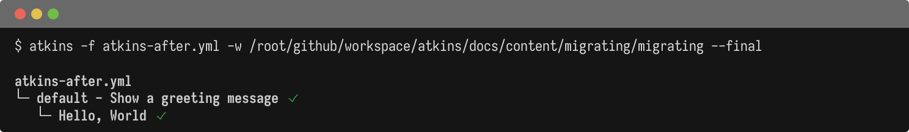

If you're using Taskfile, GitHub Actions workflows for local tasks, or another task runner, Atkins offers a familiar syntax.

Atkins supports two syntax styles (Taskfile-compatible and GitHub Actions-inspired) so migration often involves only minor changes to your existing configuration.

## Quick Comparison

@tabs
@file "Atkins" migrating/atkins-after.yml
@file "Taskfile" migrating/taskfile-before.yml



## Why Migrate?

- Cleaner interpolation syntax: Atkins uses `${{ var }}` for variable interpolation and `$(command)` for shell substitution, which don't require YAML quoting or conflict with bash syntax
- Full environment inheritance: Commands inherit the shell environment automatically, reducing configuration boilerplate
- Local and CI parity: The same configuration works for local development and CI environments
- Smaller binary: Single ~10MB binary with minimal dependencies
- Skills system: Modular, reusable pipelines that can be shared across projects and activated conditionally

## Migration Guides

Choose the guide that matches your current tool:

- [Migrating from Taskfile](./migration-from-task) - Covers syntax differences including interpolation, shell substitution, and environment handling
- [Migrating from GitHub Actions](./migration-from-github-actions) - Covers syntax mapping including triggers, actions, matrix builds, and field naming

## Using Atkins in CI

Atkins can run inside CI environments alongside or instead of native CI syntax. Pull the binary from the Docker image:

```dockerfile
COPY --from=titpetric/atkins:latest /usr/local/bin/atkins /usr/local/bin/atkins
```

Or install it in a GitHub Actions workflow:

```yaml
jobs:
  build:
    runs-on: ubuntu-latest
    steps:
      - uses: actions/checkout@v4
      - name: Install Atkins
        run: go install github.com/titpetric/atkins@latest
      - name: Run pipeline
        run: atkins
```

Use the `--final` flag for CI-friendly output that skips the interactive tree:

```bash
atkins --final
```

## Next Steps

- [Configuration](../usage/configuration) - Full configuration reference
- [Why use Atkins?](../getting-started/why-atkins) - Detailed comparison with other tools
