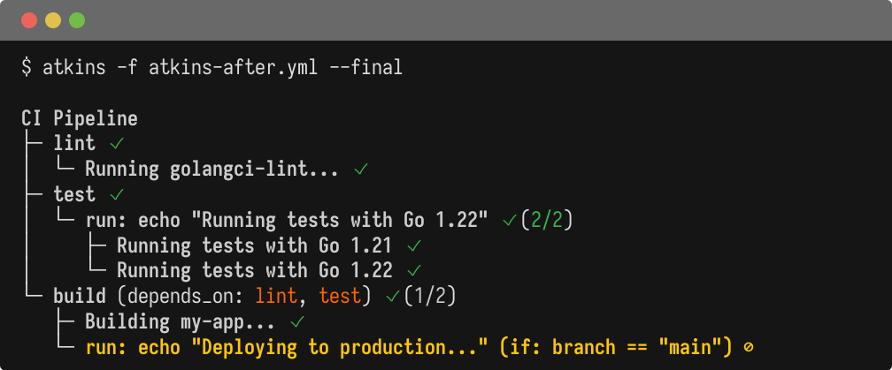

Atkins supports a GitHub Actions-inspired syntax with `jobs:` and `steps:`, familiar for teams that use GHA workflows. Atkins runs similar job definitions locally and in any CI environment, but does not replace GitHub Actions as a CI platform.

## Full Example

Here's a complete CI pipeline comparison showing jobs, dependencies, matrix builds, and conditional execution:

@tabs
@file "Atkins" migration-from-github-actions/atkins-after.yml
@file "GitHub Actions" migration-from-github-actions/workflow-before.yml



## Syntax Comparison

**GitHub Actions:**

```yaml
name: Build

on: [push]

jobs:
  build:
    runs-on: ubuntu-latest
    steps:
      - uses: actions/checkout@v4
      - name: Build
        run: go build ./...
```

**Atkins:**

```yaml
name: Build

jobs:
  build:
    steps:
      - name: Build
        run: go build ./...
```

## Key Differences

### No Triggers or Runner Selection

Atkins doesn't handle CI triggers (`on:`) or runner selection (`runs-on:`). It's a command runner, not a CI platform. Use it within your existing CI or as a local development tool.

### No `uses:` Actions

Atkins has no equivalent to GitHub's action marketplace. Actions like `actions/checkout` or `actions/setup-go` must be replaced with shell commands or handled by your CI environment:

```yaml
# GHA actions have no Atkins equivalent
# Checkout: handled by CI before invoking Atkins
# Setup: use your environment's package manager or pre-installed tools
```

### Inline Job Invocation

Atkins supports `task:` to invoke another job inline within a step. GitHub Actions has no equivalent; GHA jobs form a DAG via `needs:` and cannot call each other mid-execution.

**Atkins:**

```yaml
jobs:
  build:
    steps:
      - task: lint      # invoke lint job here
      - task: test      # then test job
      - run: go build ./...

  lint:
    steps:
      - run: golangci-lint run

  test:
    steps:
      - run: go test ./...
```

In GHA, this requires expressing the full dependency graph upfront with `needs:`.

### Field Name Differences

| GitHub Actions | Atkins        |
|----------------|---------------|
| `runs-on`      | Not supported |
| `needs`        | `depends_on:` |

## Jobs and Dependencies

**GitHub Actions:**

```yaml
jobs:
  test:
    runs-on: ubuntu-latest
    steps:
      - run: go test ./...

  build:
    needs: test
    runs-on: ubuntu-latest
    steps:
      - run: go build ./...
```

**Atkins:**

```yaml
jobs:
  test:
    steps:
      - run: go test ./...

  build:
    depends_on: test
    steps:
      - run: go build ./...
```

## Variables

**GitHub Actions:**

```yaml
env:
  MY_VAR: value

jobs:
  build:
    env:
      BUILD_VAR: ${{ env.MY_VAR }}
    steps:
      - run: echo $BUILD_VAR
```

**Atkins:**

```yaml
vars:
  my_var: value

jobs:
  build:
    env:
      vars:
        BUILD_VAR: ${{ my_var }}
    steps:
      - run: echo "$BUILD_VAR"
```

## Secrets

GitHub Actions provides encrypted secrets via the `secrets` context. Atkins has no built-in secrets management.

**GitHub Actions:**

```yaml
jobs:
  deploy:
    steps:
      - run: ./deploy.sh
        env:
          API_KEY: ${{ secrets.API_KEY }}
          DB_PASSWORD: ${{ secrets.DB_PASSWORD }}
```

**Atkins:**

```yaml
jobs:
  deploy:
    steps:
      # Secrets must come from the environment
      - run: ./deploy.sh
```

Pass secrets via environment variables when invoking Atkins:

```bash
API_KEY=xxx DB_PASSWORD=yyy atkins deploy
```

Or use a secrets manager that populates the environment (Vault, AWS Secrets Manager, `direnv`, etc.).

## Matrix Builds

GHA's matrix strategy maps to Atkins' `for:` loops. Atkins supports multi-iterator syntax for cartesian products (all combinations), which is a direct equivalent to GHA's multi-dimensional matrix:

**GitHub Actions:**

```yaml
jobs:
  build:
    strategy:
      matrix:
        os: [linux, darwin]
        arch: [amd64, arm64]
    runs-on: ubuntu-latest
    steps:
      - run: echo "Building for ${{ matrix.os }}-${{ matrix.arch }}"
```

**Atkins (multi-iterator):**

```yaml
vars:
  os: [linux, darwin]
  arch: [amd64, arm64]

jobs:
  build:
    steps:
      - for:
          - os in os
          - arch in arch
        run: echo "Building for ${{ os }}-${{ arch }}"
```

Both produce 4 iterations: `linux-amd64`, `linux-arm64`, `darwin-amd64`, `darwin-arm64`.

**Key advantages of Atkins' approach:**

- No separate `strategy` block - iterators are defined inline
- Variables can come from `vars:`, inline arrays, or shell commands
- Works with any step type (`run:`, `task:`, `cmd:`)
- Nested tasks can add additional iteration dimensions

For single-dimension iteration:

```yaml
vars:
  go_versions: ['1.21', '1.22']

jobs:
  test:
    steps:
      - for: version in go_versions
        run: echo "Testing with Go ${{ version }}"
```

## Conditional Execution

**GitHub Actions:**

```yaml
- name: Deploy
  if: github.ref == 'refs/heads/main'
  run: echo "Deploying..."
```

**Atkins:**

```yaml
vars:
  branch: $(git rev-parse --abbrev-ref HEAD)

jobs:
  deploy:
    steps:
      - name: Deploy
        if: branch == "main"
        run: echo "Deploying to production..."
```

Atkins uses [expr-lang](https://expr-lang.org/) for condition evaluation. The `branch` variable is not built-in; define it explicitly in `vars:` (here using a dynamic shell command).

## Parallel Execution

GitHub Actions runs jobs in parallel by default. Atkins runs jobs sequentially unless you use `detach: true`:

```yaml
jobs:
  lint:
    detach: true  # Run in background
    steps:
      - run: golangci-lint run

  test:
    detach: true  # Run in parallel with lint
    steps:
      - run: go test ./...

  build:
    depends_on: [lint, test]  # Wait for both
    steps:
      - run: go build ./...
```

## Summary

| Concept             | GitHub Actions              | Atkins                          |
|---------------------|-----------------------------|---------------------------------|
| Triggers            | `on: [push]`                | Not supported (use CI)          |
| Runner selection    | `runs-on:`                  | Not supported (local execution) |
| Marketplace actions | `uses: actions/checkout@v4` | No equivalent                   |
| Job dependencies    | `needs:`                    | `depends_on:`                   |
| Inline job calls    | Not supported               | `task:` in steps                |
| Secrets             | `${{ secrets.X }}`          | Environment variables           |
| Matrix              | `strategy.matrix`           | `for:` with multi-iterator      |
| Parallel            | Default                     | `detach: true`                  |

## Best Practices

1. Atkins runs commands; use your CI platform for triggers, runners, and secrets
2. Run the same tasks locally that CI runs
3. Call `atkins` from your GHA workflow for consistency
