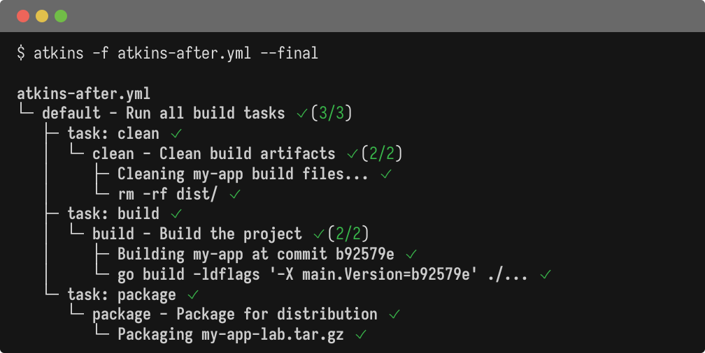

Atkins supports a Taskfile-compatible structure. The main differences are in interpolation syntax and shell substitution. Simple Taskfiles without interpolation often work without any changes.

## Full Example

Here's a complete side-by-side comparison showing variable interpolation, shell substitution, and task dependencies:

@tabs
@file "Atkins" migration-from-task/atkins-after.yml
@file "Taskfile" migration-from-task/taskfile-before.yml



## Structure Comparison

The overall structure is nearly identical. Atkins doesn't require a `version` field.

**Taskfile:**

```yaml
version: '3'

vars:
  key: val

tasks:
  default:
    cmds:
      - cmd: echo hello
      - task: other
```

**Atkins:**

```yaml
vars:
  key: val

tasks:
  default:
    cmds:
      - cmd: echo hello
      - task: other
```

The `task: <name>` syntax for invoking other tasks works identically in both tools.

## Shell Substitution

Taskfile uses the `sh:` field for dynamic values. Atkins uses bash-style `$(...)` which can also be used inline within commands.

**Taskfile:**

```yaml
vars:
  uname:
    sh: uname -n
```

**Atkins:**

```yaml
vars:
  uname: $(uname -n)
```

## Variable Interpolation

Taskfile uses Go templates which require quoting in YAML. Atkins uses `${{ }}` syntax which is YAML-safe.

**Taskfile:**

```yaml
vars:
  foo: bar
  bar: "{{.foo}}"  # Must be quoted

tasks:
  default:
    cmds:
      - echo "{{.foo}}"
```

**Atkins:**

```yaml
vars:
  foo: bar
  bar: ${{ foo }}  # No quotes needed

tasks:
  default:
    cmds:
      - echo "${{ foo }}"
```

Benefits of the Atkins syntax:
- No quoting required in YAML
- No `.` prefix for variable names
- Doesn't conflict with bash `${var}` syntax

## Environment Variables

Taskfile requires explicit environment declarations and doesn't inherit from the shell by default. Atkins inherits the full environment automatically.

You can still declare environment variables at any level:

```yaml
env:
  vars:
    MY_VAR: value

tasks:
  build:
    env:
      vars:
        GOOS: linux
    steps:
      - run: go build
```

## Simple Tasks

Both support shorthand syntax for single-command tasks:

```yaml
tasks:
  up: docker compose up -d
  down: docker compose down
```

## Listing Tasks

**Taskfile:**

```bash
task --list-all  # -l requires descriptions
```

**Atkins:**

```bash
atkins -l  # Shows all tasks; uses command as description if none provided
```

Atkins always shows tasks, displaying the command when no description is set.

## What Works Directly

Simple Taskfiles without interpolation work identically:

```yaml
tasks:
  up: docker compose up -d --remove-orphans
  down: docker compose down --remove-orphans
```

## Summary

| Feature                | Taskfile                    | Atkins                              |
|------------------------|-----------------------------|-------------------------------------|
| Version field          | `version: '3'` (required)   | Not required                        |
| Variable interpolation | `{{.var}}`                  | `${{ var }}`                        |
| Shell substitution     | `sh: command`               | `$(command)`                        |
| Task invocation        | `task: name`                | `task: name`                        |
| Dependencies           | `deps:`                     | `depends_on:`                       |
| Conditionals           | `preconditions:`, `status:` | `if:` (expr-lang)                   |
| Deferred commands      | `defer:`                    | `deferred: true` or `defer:`        |
| Loops                  | `for:`                      | `for:`                              |
| Includes               | `includes:`                 | `include:`                          |
| Environment loading    | `dotenv:`                   | `env: include:` or `vars: include:` |
| Hidden tasks           | `internal: true`            | `show: false`                       |
| File caching           | `sources:`, `generates:`    | Not supported                       |
| Watch mode             | `--watch`                   | Not supported                       |
| Binary size            | ~15MB                       | ~10MB                               |
