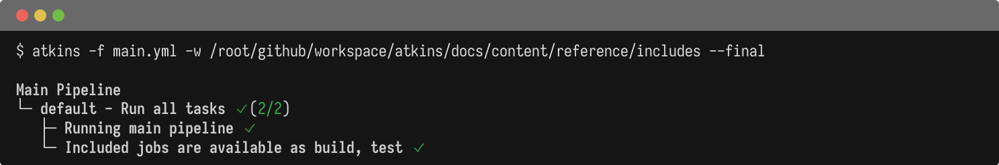

Compose pipelines from multiple files using `include:` at the pipeline level.

## Basic Include

Include jobs from external files:

@tabs
@file "Main" includes/main.yml
@file "build.yml" includes/ci/build.yml
@file "test.yml" includes/ci/test.yml



## Glob Patterns

Use glob patterns to include multiple files:

```yaml
name: My Pipeline

include: ci/*.yml

jobs:
  default:
    steps:
      - run: echo "Jobs from ci/*.yml are now available"
```

## Include Behavior

- Included files contribute their jobs to the main pipeline
- Job names from included files are available directly
- Duplicate job names cause an error
- Relative paths are resolved from the main file's directory

## Use Cases

### Split by Domain

```yaml
name: My Project

include:
  - docker/*.yml
  - test/*.yml
  - deploy/*.yml

jobs:
  default:
    steps:
      - task: docker:build
      - task: test:unit
```

### Team-Specific Files

```yaml
name: Monorepo

include:
  - frontend/tasks.yml
  - backend/tasks.yml
  - infra/tasks.yml

jobs:
  all:
    steps:
      - run: echo "All team tasks are available"
```

## See Also

- [Pipeline](./pipeline) - Pipeline configuration
- [Jobs](./jobs) - Job configuration
