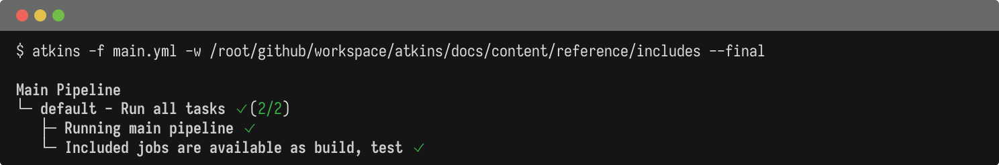

`include:` reads one or more files into `vars`, at the pipeline, job or step level. It does not merge jobs: an included file's `jobs:` section, if it has one, is ignored. To share jobs across files, use [Skills](../usage/skills).

## Basic Include

@tabs
@file "Main" includes/main.yml
@file "build.yml" includes/ci/build.yml
@file "test.yml" includes/ci/test.yml



`ci/build.yml` and `ci/test.yml` are plain YAML documents of variables, not pipelines. Their top-level keys land in `vars`, exactly as if they had been written into `main.yml` directly.

## Merge Order

A later file in the list overrides an earlier one, and the block's own `vars:` overrides every included file, whichever order they appear in:

```yaml
include:
  - ci/build.yml   # tag: v1.2.3
  - ci/test.yml    # tag: v1.2.3-rc (wins over ci/build.yml)

vars:
  tag: v2.0.0        # wins over both included files
```

## Relative Paths

A path in `include:` is resolved from the current working directory atkins was run from, not from the file that declares it. A pipeline that includes a file next to itself only works when invoked from that directory; write the include relative to where the pipeline is meant to be run, or resolve it with `$(...)` first.

No glob expansion happens: `include: ci/*.yml` is read as a literal filename and fails with "no such file or directory" rather than matching multiple files. List every file `include:` should read.

## Environment Includes

`env: include:` does the same for `env`, but reads a dotenv file (`KEY=value` lines) instead of YAML:

```yaml
env:
  include: .env.production
  vars:
    LOG_LEVEL: debug   # wins over .env.production
```

## See Also

- [Pipeline](./pipeline) - Pipeline configuration
- [Variables](./variables) - Variable interpolation
- [Skills](../usage/skills) - Sharing jobs across files
