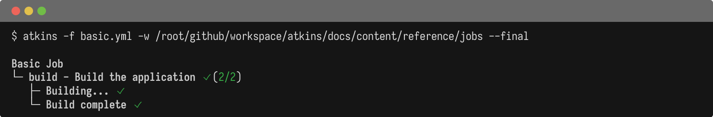
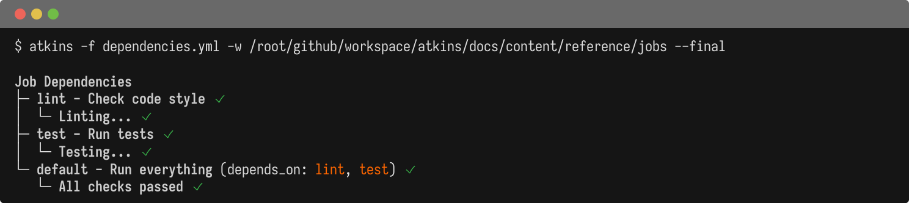
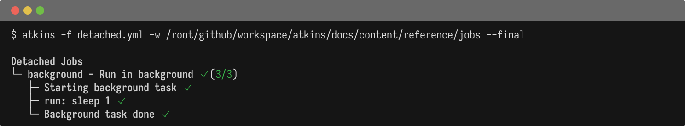
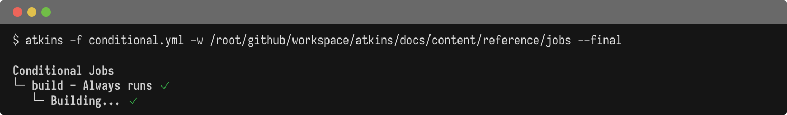
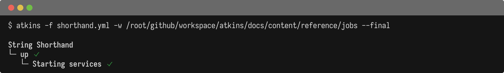
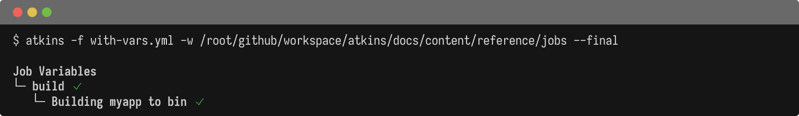

Jobs define units of work in a pipeline. Each job contains steps to execute.

## Properties

| Field | Type | Default | Description |
|-------|------|---------|-------------|
| `desc` | string | - | Short description for `--list` |
| `depends_on` | list | `[]` | Jobs to run before this job |
| `steps` | list | `[]` | Steps to execute (or `cmds:`) |
| `vars` | map | `{}` | Job-level variables |
| `env` | object | `{}` | Job-level environment |
| `if` | string | - | Conditional execution expression |
| `dir` | string | - | Working directory override |
| `detach` | bool | `false` | Run in background |
| `show` | bool | `true` | Show in `--list` output |

## Basic Job

@tabs
@file "Pipeline" jobs/basic.yml

## Job Dependencies

Jobs can depend on other jobs using `depends_on`:

@tabs
@file "Pipeline" jobs/dependencies.yml

## Detached Jobs

Run jobs in the background with `detach: true`:

@tabs
@file "Pipeline" jobs/detached.yml

## Conditional Jobs

Execute jobs conditionally using `if`:

@tabs
@file "Pipeline" jobs/conditional.yml

## String Shorthand

For simple jobs with a single command, use string shorthand:

@tabs
@file "Pipeline" jobs/shorthand.yml

## Job Variables

Jobs can define their own variables that merge with pipeline-level ones:

@tabs
@file "Pipeline" jobs/with-vars.yml

## See Also

- [Steps](./steps) - Step configuration
- [Variables](./variables) - Variable interpolation
