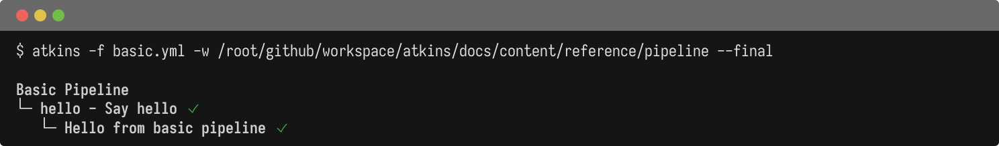
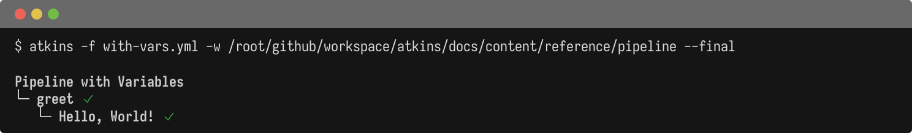
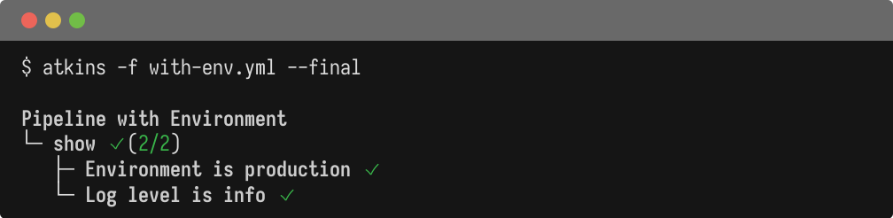
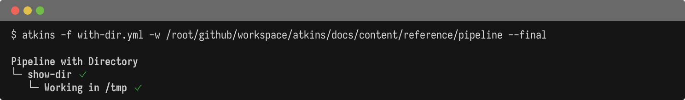

The pipeline is the root configuration object in an Atkins file.

## Properties

| Field     | Type        | Default | Description                    |
|-----------|-------------|---------|--------------------------------|
| `name`    | string      | -       | Pipeline name for display      |
| `dir`     | string      | `.`     | Working directory for all jobs |
| `vars`    | map         | `{}`    | Pipeline-level variables       |
| `env`     | object      | `{}`    | Environment variables          |
| `jobs`    | map         | -       | Job definitions                |
| `tasks`   | map         | -       | Alias for `jobs`               |
| `include` | string/list | -       | External file inclusion        |
| `when`    | object      | -       | Skill activation conditions    |

### `when` Object

| Field   | Type | Description                                      |
|---------|------|--------------------------------------------------|
| `files` | list | Files that must exist for pipeline to be enabled |

## Basic Pipeline

@tabs
@file "Pipeline" pipeline/basic.yml



## With Variables

@tabs
@file "Pipeline" pipeline/with-vars.yml



## With Environment

@tabs
@file "Pipeline" pipeline/with-env.yml



## With Working Directory

@tabs
@file "Pipeline" pipeline/with-dir.yml



## Environment Inheritance

Atkins passes the full shell environment to all commands. There is no need to explicitly declare which variables to inherit.

```yaml
jobs:
  show-env:
    steps:
      # $HOME, $PATH, $USER etc. are all available
      - run: echo "Home is $HOME"
```

## See Also

- [Variables](./variables) - Variable interpolation
- [Jobs](./jobs) - Job configuration
- [Includes](./includes) - File inclusion
