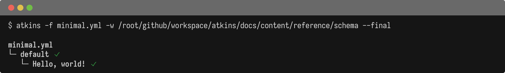
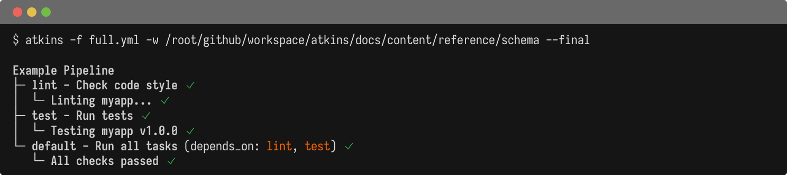

Atkins pipelines are YAML files defining jobs and steps. Unlike Taskfile, Atkins does not require a schema version declaration.

## Minimal Pipeline

@tabs
@file "Pipeline" schema/minimal.yml

## Full Structure

@tabs
@file "Pipeline" schema/full.yml

## Root Properties

| Field            | Type        | Description                    |
|------------------|-------------|--------------------------------|
| `name`           | string      | Pipeline name (optional)       |
| `dir`            | string      | Working directory for all jobs |
| `vars`           | map         | Pipeline-level variables       |
| `env`            | object      | Environment variables          |
| `jobs` / `tasks` | map         | Job definitions                |
| `include`        | string/list | External file inclusion        |
| `when`           | object      | Skill activation conditions    |

## Syntax Flavors

Atkins supports two interchangeable syntax styles:

| Style          | Jobs Keyword | Steps Keyword    |
|----------------|--------------|------------------|
| GitHub Actions | `jobs:`      | `steps:`, `run:` |
| Taskfile       | `tasks:`     | `cmds:`, `cmd:`  |

Both styles can be mixed in the same file.

## See Also

- [Pipeline](./pipeline) - Pipeline-level properties
- [Jobs](./jobs) - Job configuration
- [Steps](./steps) - Step configuration
- [Variables](./variables) - Variable interpolation
