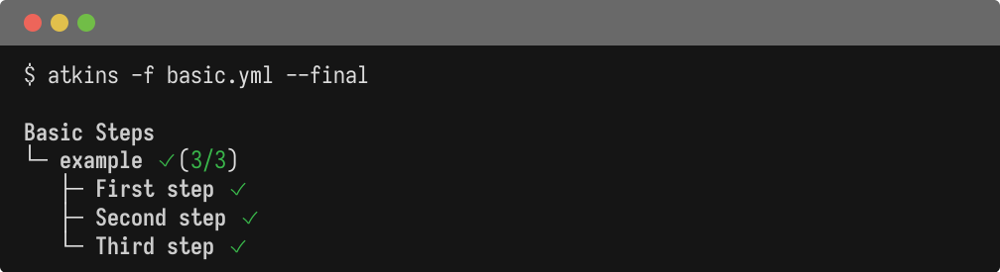
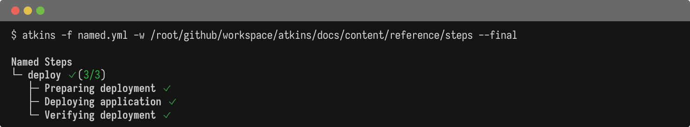
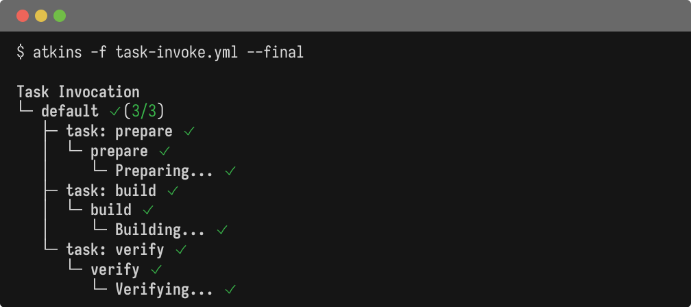
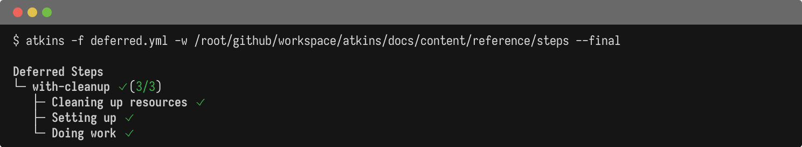
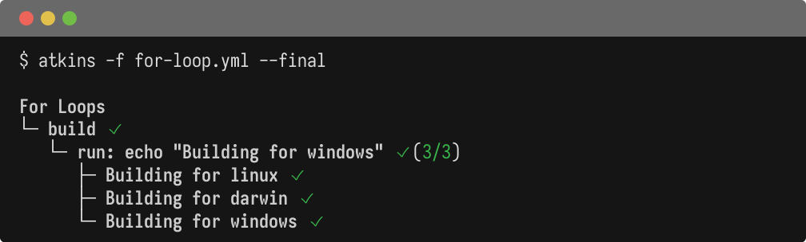
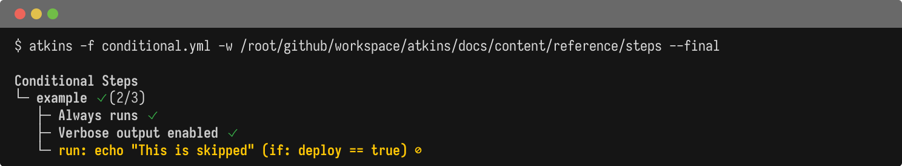
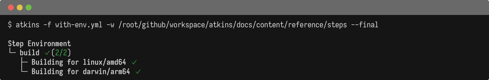

Steps are the individual commands or actions within a job.

Steps can be defined using either `steps:` (GitHub Actions style) or `cmds:` (Taskfile style). Both are interchangeable.

## String Shorthand

Steps can be written as bare strings without `run:` or `cmd:` prefix:

```yaml
steps:
  - echo "hello"          # bare string
  - run: echo "hello"     # equivalent explicit form
  - cmd: echo "hello"     # also equivalent
```

## Properties

| Field         | Type        | Default | Description                          |
|---------------|-------------|---------|--------------------------------------|
| `name`        | string      | -       | Step name for display                |
| `desc`        | string      | -       | Step description (shown in output)   |
| `run`         | string      | -       | Command to execute                   |
| `cmd`         | string      | -       | Alias for `run`                      |
| `cmds`        | list        | -       | Multiple commands to run in sequence |
| `task`        | string      | -       | Task/job to invoke                   |
| `if`          | string      | -       | Conditional execution                |
| `for`         | string      | -       | Loop iteration                       |
| `vars`        | map         | `{}`    | Step-level variables                 |
| `env`         | object      | -       | Step environment                     |
| `include`     | string/list | -       | Include external files               |
| `dir`         | string      | -       | Working directory                    |
| `deferred`    | bool        | `false` | Run on cleanup (like Go defer)       |
| `defer`       | string/obj  | -       | Deferred step (shorthand or object)  |
| `detach`      | bool        | `false` | Run in background                    |
| `tty`         | bool        | `false` | Allocate PTY (enables colors)        |
| `interactive` | bool        | `false` | Stream output live, connect stdin    |
| `verbose`     | bool        | `false` | Show output                          |
| `summarize`   | bool        | `false` | Summarize output                     |
| `quiet`       | bool        | `false` | Suppress output                      |
| `passthru`    | bool        | `false` | Print output with tree indentation   |

## Basic Steps

@tabs
@file "Pipeline" steps/basic.yml



## Named Steps

@tabs
@file "Pipeline" steps/named.yml



## Task Invocation

Call other jobs using `task:`:

@tabs
@file "Pipeline" steps/task-invoke.yml



## Deferred Steps

Steps run after the job completes (like `defer` in Go). Two syntax options:

**Using `deferred: true`:**

```yaml
steps:
  - run: cleanup.sh
    deferred: true
```

**Using `defer:` wrapper:**

```yaml
steps:
  - defer: cleanup.sh
```

@tabs
@file "Pipeline" steps/deferred.yml



## For Loops

Iterate over lists with `for:`:

@tabs
@file "Pipeline" steps/for-loop.yml



## Conditional Steps

Execute steps conditionally using `if`:

@tabs
@file "Pipeline" steps/conditional.yml



## Step Environment

Override environment for a single step:

@tabs
@file "Pipeline" steps/with-env.yml



## See Also

- [Jobs](./jobs) - Job configuration
- [Variables](./variables) - Variable interpolation
