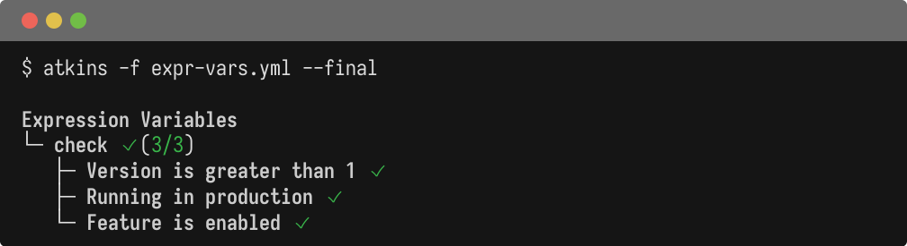
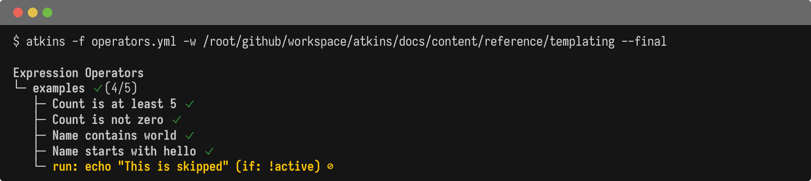
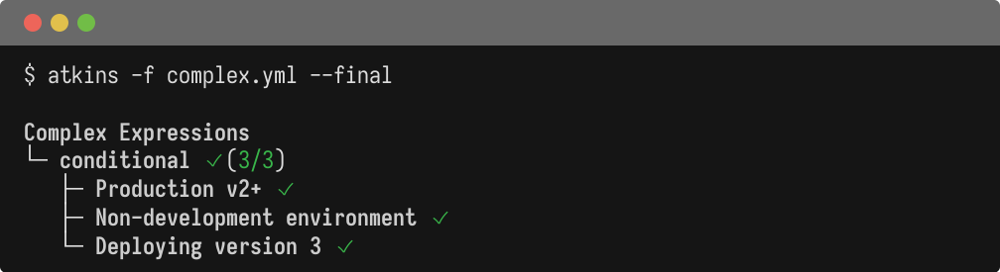

Atkins uses [expr-lang](https://expr-lang.org/) for conditional expressions in `if:` fields.

## Expression Syntax

Expressions are evaluated as boolean conditions:

```yaml
if: version > 1
if: env == "production"
if: enabled == true
```

## Available Variables

All pipeline and job variables are available in expressions:

@tabs
@file "Pipeline" templating/expr-vars.yml



## Operators

### Comparison

| Operator | Description      |
|----------|------------------|
| `==`     | Equal            |
| `!=`     | Not equal        |
| `>`      | Greater than     |
| `<`      | Less than        |
| `>=`     | Greater or equal |
| `<=`     | Less or equal    |

### Logical

| Operator | Description |
|----------|-------------|
| `&&`     | Logical AND |
| `        |             |
| `!`      | Logical NOT |

### String

| Operator              | Description     |
|-----------------------|-----------------|
| `s contains substr`   | Check substring |
| `s startsWith prefix` | Check prefix    |
| `s endsWith suffix`   | Check suffix    |

## Examples

@tabs
@file "Pipeline" templating/operators.yml



## Complex Expressions

@tabs
@file "Pipeline" templating/complex.yml



## Truthiness

- Empty strings are falsy
- Zero is falsy
- `false` is falsy
- Everything else is truthy

## See Also

- [Variables](./variables) - Variable interpolation
- [Steps](./steps) - Conditional steps
- [Jobs](./jobs) - Conditional jobs
