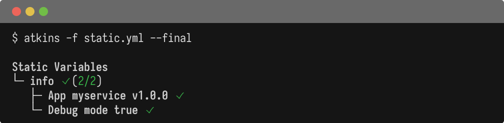
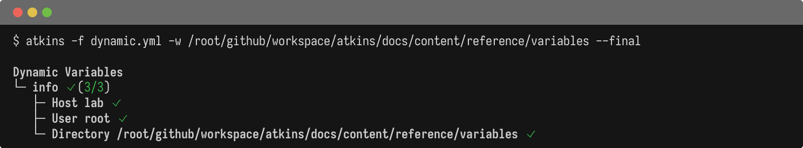
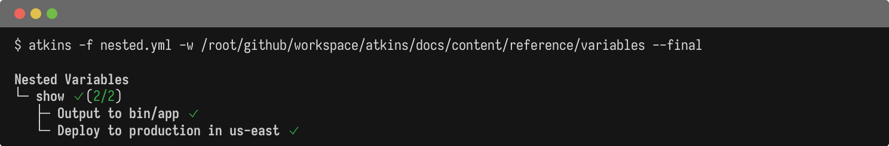
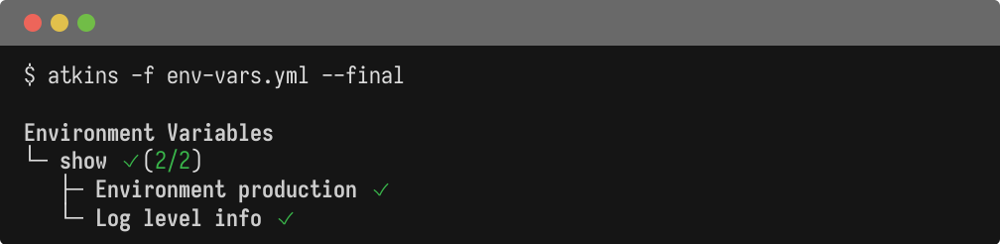
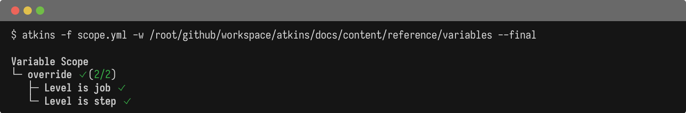

Atkins supports variables at pipeline, job, and step levels with two interpolation syntaxes.

## Interpolation Syntax

### `${{ expr }}` - Atkins Variables

Atkins uses `${{ expr }}` for variable interpolation. This avoids conflicts with bash `${var}`:

```yaml
vars:
  name: world
jobs:
  hello:
    steps:
      - run: echo "Hello, ${{ name }}!"
```

### `$(command)` - Shell Execution

Shell command output can populate variable values:

```yaml
vars:
  date: $(date +%Y-%m-%d)
jobs:
  show:
    steps:
      - run: echo "Today is ${{ date }}"
```

## Static Variables

@tabs
@file "Pipeline" variables/static.yml



## Dynamic Shell Variables

@tabs
@file "Pipeline" variables/dynamic.yml



## Nested Variables

Access nested values with dot notation:

@tabs
@file "Pipeline" variables/nested.yml



## Environment Variables

Set environment variables with `env:`:

@tabs
@file "Pipeline" variables/env-vars.yml



## Variable Scope

Variables cascade from pipeline to job to step:

@tabs
@file "Pipeline" variables/scope.yml



## Coexistence with Shell

Atkins `${{ }}` and shell `$VAR`/`${VAR}` can coexist without escaping:

```yaml
vars:
  binary: app
jobs:
  build:
    steps:
      # ${{ binary }} resolved by Atkins before execution
      # $USER and ${GIT_TAG} resolved by shell at runtime
      - run: echo "Building ${{ binary }} as $USER at ${GIT_TAG}"
```

Atkins resolves `${{ }}` interpolations first, then passes the resulting command to the shell which handles `$VAR` and `${VAR}` references.

## See Also

- [Pipeline](./pipeline) - Pipeline-level configuration
- [Templating](./templating) - Expression syntax
