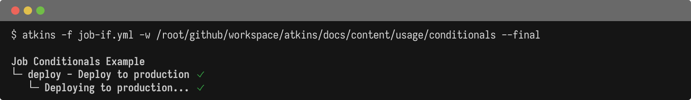

Jobs and steps can be conditionally executed using the `if:` field. Conditions are evaluated using [expr-lang](https://expr-lang.org/), a simple expression language. The `if:` field accepts a single expression or a list of expressions. When a list is provided, all conditions must be true (AND logic).

## Examples

@tabs
@file "Job Conditionals" conditionals/job-if.yml
@file "Step Conditionals" conditionals/step-if.yml



## Available Variables

Conditions have access to:

1. **Pipeline variables** - All variables defined in `vars:` blocks
2. **Environment variables** - All environment variables (from shell and `env:` blocks)
3. **Loop variables** - When inside a `for:` loop, the loop variable is available

## Expression Syntax

Expr-lang supports common operators and comparisons:

| Operator             | Description | Example                      |
|----------------------|-------------|------------------------------|
| `==`                 | Equals      | `env == "prod"`              |
| `!=`                 | Not equals  | `env != "dev"`               |
| `&&`                 | Logical AND | `a == 1 && b == 2`           |
| `                    |             | `                            |
| `!`                  | Logical NOT | `!skip_tests`                |
| `>`, `<`, `>=`, `<=` | Comparisons | `num_retries > 0`            |
| `in`                 | Contains    | `"prod" in environments`     |
| `matches`            | Regex match | `branch matches "^release/"` |

## Examples

**Combining conditions (inline):**

```yaml
if: environment == "production" && branch == "main"
```

**Combining conditions (list form):**

```yaml
if:
  - branch == "main"
  - environment == "production"
```

Both forms are equivalent. The list form is useful when conditions are long or numerous.

**Checking for values in lists:**

```yaml
vars:
  allowed_envs:
    - staging
    - production

jobs:
  deploy:
    if: environment in allowed_envs
    steps:
      - run: echo "Deploying..."
```

**Pattern matching:**

```yaml
if: branch matches "^release/.*"
```

## Truthiness

Values are coerced to boolean as follows:

| Value               | Result |
|---------------------|--------|
| `true`              | true   |
| `false`             | false  |
| `nil` / undefined   | false  |
| `""` (empty string) | false  |
| `"false"`, `"0"`    | false  |
| Any other string    | true   |
| `0`                 | false  |
| Any other number    | true   |

## Undefined Variables

Undefined variables evaluate to `nil` (falsy) rather than causing an error:

```yaml
jobs:
  optional:
    if: maybe_defined
    steps:
      - run: echo "Running optional job..."
```

## Skipped Output

When a job or step is skipped due to a condition, the tree output shows the condition:

```text
[ok] build
[skip] deploy (if: environment == "production")
```

## See Also

- [Jobs](./jobs) - Job configuration
- [Steps](./steps) - Step configuration
