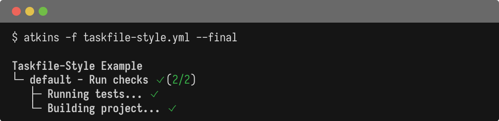
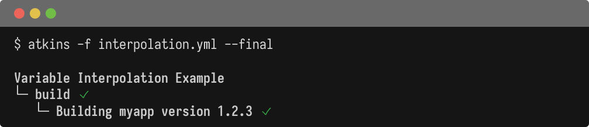

Atkins pipelines are defined in YAML files, typically named `atkins.yml` or `.atkins.yml`. A pipeline contains jobs (or tasks), each with a sequence of steps to execute. Atkins supports two syntax styles (Taskfile-compatible and GitHub Actions-inspired) which can be mixed in the same file.

## Basic Structure

A minimal pipeline file:

```yaml
name: My Project

jobs:
  default:
    desc: Run everything
    steps:
      - run: echo "Hello, world!"
```

## Syntax Flavors

Atkins supports two syntax styles. Both can be used interchangeably within the same file.

@tabs
@file "Taskfile-Style" configuration/taskfile-style.yml
@file "GHA-Style" configuration/gha-style.yml



## Variable Interpolation

Atkins uses `${{ expr }}` for variable interpolation. This syntax avoids conflicts with bash `$VAR` and `${var}`. Atkins resolves `${{ }}` first, then passes the command to the shell which handles `$VAR` and `${VAR}`. Both can coexist without escaping. Shell command output can fill variable values using `$(command)` syntax in `vars:`, `env:`, and inline values.

@tabs
@file "Interpolation" configuration/interpolation.yml



## Environment (`env:`)

The `env:` block sets environment variables. It can appear at the pipeline, job, or step level.

```yaml
env:
  vars:
    GIT_COMMIT: $(git rev-parse HEAD)
    GIT_BRANCH: $(git rev-parse --abbrev-ref HEAD)

jobs:
  build:
    steps:
      - run: echo "Commit is $GIT_COMMIT on $GIT_BRANCH"
```

Step-level environment overrides:

```yaml
jobs:
  install:
    steps:
      - env:
          vars:
            CGO_ENABLED: 0
            GOOS: linux
            GOARCH: amd64
        run: go build -o bin/app .
```

### Environment Inheritance

Atkins passes the existing shell environment through to all commands. There's no need to explicitly declare which variables to pass. Everything is inherited automatically. This differs from tools like Taskfile that require explicit environment declarations.

## Include (`include:`)

Compose pipelines from multiple files using `include:` at the pipeline level:

```yaml
name: My Project

include: ci/*.yml

jobs:
  default:
    steps:
      - run: echo "Jobs from included files are available"
```

Each included file contributes its jobs to the pipeline, allowing large pipelines to be split into manageable pieces.

## Conditional Activation (`when:`)

The `when:` block controls when a skill activates based on project context. This is primarily used in [skill files](./skills).

```yaml
name: Go build and test

when:
  files:
    - go.mod

jobs:
  test:
    steps:
      - run: go test ./...
```

The skill activates only when `go.mod` exists. Multiple files use OR logic. Any match activates the skill. See [Skills](./skills) for details.

## Complete Example

```yaml
#!/usr/bin/env atkins
name: My App

env:
  vars:
    GIT_COMMIT: $(git rev-parse HEAD)
    GIT_TAG: $(git describe --tags --always)

vars:
  binary: myapp
  platforms:
    - amd64
    - arm64

jobs:
  default:
    desc: Run everything
    depends_on: fmt
    steps:
      - task: test
      - task: build

  fmt:
    desc: Format code
    steps:
      - run: gofmt -w .
      - run: go mod tidy

  test:
    desc: Run tests
    steps:
      - run: go test ./...

  build:
    desc: Cross-compile
    steps:
      - for: arch in platforms
        env:
          vars:
            CGO_ENABLED: 0
            GOARCH: ${{ arch }}
        run: go build -ldflags="-X 'main.Commit=${GIT_COMMIT}'" -o bin/${{ binary }}-${{ arch }} .
```

## See Also

- [Pipelines](./pipelines) - Pipeline-level configuration
- [Jobs](./jobs) - Job configuration and dependencies
- [Steps](./steps) - Step configuration and loops
- [CLI Flags](./cli-flags) - Command-line options
- [Job Targeting](./job-targeting) - Running specific jobs
