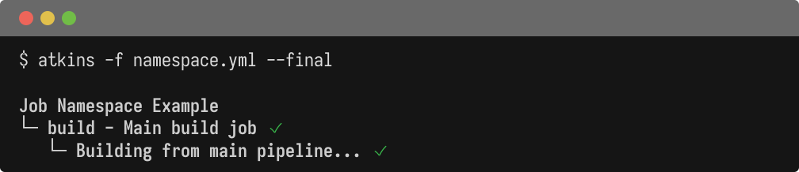

When you have multiple jobs and skills, Atkins provides flexible syntax for targeting exactly which job to run. You can target jobs by name, by skill namespace, or by alias. Understanding the resolution order helps when job names overlap.

## Basic Targeting

### Run by Name

```bash
# Run a job by its name
atkins build

# Run multiple jobs in sequence
atkins lint test build
```

### Namespaced Jobs

Jobs from skills use `skill:job` syntax:

```bash
# Run 'test' job from 'go' skill
atkins go:test

# Run 'build' job from 'docker' skill
atkins docker:build
```

## The Default Job

When running `atkins` without arguments:

1. Looks for a job named `default`
2. Falls back to a job with `default` in its aliases

```yaml
jobs:
  all:
    aliases: [default]
    depends_on: [lint, test, build]
```

If no default is found, Atkins shows available jobs:

```text
atkins: Available jobs for this project:
* build:       Build the application
* test:        Run tests
atkins: Job "default" does not exist
```

## Invoked Pipeline (`:` Prefix)

The `:` prefix directly invokes a job, bypassing alias resolution.

### Invoke Main Pipeline Job

```bash
# Invoke 'build' in main pipeline (bypasses aliases)
atkins :build
```

Use this when:
- A skill has aliased `build` but you want the main pipeline's `build`
- You want to skip alias resolution entirely

### Invoke Skill Pipeline Job

```bash
# Invoke 'build' job in 'go' skill
atkins :go:build

# Invoke 'test' job in 'docker' skill
atkins :docker:test
```

## Cross-Pipeline Task References

Within a pipeline, steps can reference tasks from other pipelines using `:` syntax.

### Reference Main Pipeline

```yaml
# In a skill pipeline
jobs:
  deploy:
    steps:
      # Call 'build' from main pipeline
      - task: :build
      - run: echo "Deploying..."
```

### Reference Other Skills

```yaml
# In release skill
jobs:
  release:
    steps:
      # Call tasks from other skills
      - task: :go:build
      - task: :docker:build
      - task: :docker:push
```

### Example: Multi-Skill Coordination

**Main pipeline (atkins.yml):**

```yaml
name: My App

jobs:
  build:
    steps:
      - run: go build -o app

  deploy:
    steps:
      - task: :go:test      # From go skill
      - task: :docker:build  # From docker skill
      - run: kubectl apply -f k8s/
```

**Go skill (.atkins/skills/go.yml):**

```yaml
name: Go Skill
when:
  files: [go.mod]

jobs:
  test:
    steps:
      - run: go test ./...
```

**Docker skill (.atkins/skills/docker.yml):**

```yaml
name: Docker Skill
when:
  files: [Dockerfile]

jobs:
  build:
    steps:
      - run: docker build -t app .
```

## Aliases

Jobs can have alternative names:

@tabs
@file "Namespace" job-targeting/namespace.yml
@file "Aliases" job-targeting/aliases.yml



Now all of these work:

```bash
atkins docker:build  # Full name
atkins build         # Alias
atkins b             # Short alias
atkins db            # Another alias
```

## Job Resolution Order

When you invoke `atkins <name>`, resolution follows this precedence:

1. **Invoked pipeline** (`:` prefix) - directly invoke job, bypassing aliases
2. **Main pipeline exact match** - job name matches exactly in main pipeline
3. **Main pipeline alias** - alias matches in main pipeline
4. **Skills exact match** - job name matches in a skill pipeline
5. **Prefixed job** (`skill:job` syntax) - explicit skill targeting
6. **Skills alias** - alias matches in a skill pipeline
7. **Fuzzy match** - substring/suffix match (single match only)

If no match is found, Atkins returns an error.

Main pipeline jobs and aliases take precedence over skills. If your main pipeline has a job with `aliases: [default]`, running `atkins default` will invoke it even if a skill has a job literally named `default`.

## Fuzzy Matching

If no exact match is found, Atkins tries fuzzy matching:

```bash
# If 'docker:build' exists
atkins build  # Matches via suffix
```

When multiple matches exist:

```
INFO: found 2 matching jobs:

  - go:build
  - docker:build
```

Use the full name or `:` prefix to disambiguate.

## Nested Jobs

Jobs with `:` in their name are nested and not directly executable:

```yaml
jobs:
  build:
    steps:
      - task: build:linux
      - task: build:darwin

  build:linux:    # Nested - only runs via 'build'
    steps:
      - run: GOOS=linux go build

  build:darwin:   # Nested - only runs via 'build'
    steps:
      - run: GOOS=darwin go build
```

```bash
atkins build         # Runs build:linux and build:darwin
atkins build:linux   # Error - nested job
```

## Examples

### Common Invocations

```bash
# Run default job
atkins

# Run specific job from main pipeline
atkins test
atkins up

# Run skill job (explicit)
atkins go:lint
atkins docker:build
```

### Invoked Pipeline (`:` prefix)

```bash
# Invoke main pipeline job (bypasses aliases)
atkins :up
atkins :build

# Invoke skill job directly
atkins :go:build
atkins :docker:push
```

### When to Use `:` Prefix

Use the `:` prefix when:
- You want to bypass alias resolution
- A skill has aliased a common name you want to skip

```bash
# Main pipeline has 'up' job → runs via exact match
atkins up

# Bypass aliases and invoke main pipeline 'up' directly
atkins :up
```

### Full Example

```bash
# Run default job
atkins

# Run 'build' from main pipeline
atkins build

# Run 'test' from go skill
atkins go:test

# Run 'up' from main pipeline (explicit)
atkins :up

# Run 'build' from docker skill (explicit)
atkins :docker:build

# Using alias (if 'b' is alias for build)
atkins b

# With file flag
atkins -f ci/test.yml integration
```

## See Also

- [CLI Flags](./cli-flags) - Command-line options
- [Skills](./skills) - Skill namespacing and aliases
