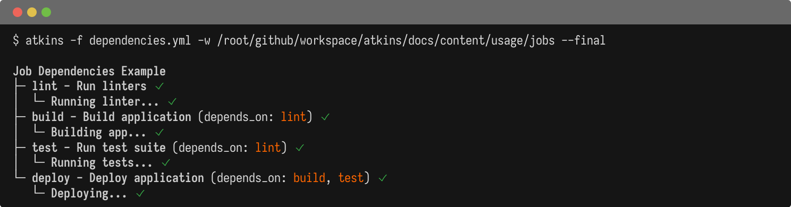

A job groups related steps and controls how they execute. Jobs are defined as a map under `jobs:` or `tasks:`.

## Job Fields

| Field               | Description                                                            |
|---------------------|------------------------------------------------------------------------|
| `desc:`             | Description shown in job listings                                      |
| `steps:`            | List of steps to execute                                               |
| `cmds:`             | Alias for `steps:` (Taskfile-style)                                    |
| `cmd:`              | Single command shorthand                                               |
| `run:`              | Alias for `cmd:`                                                       |
| `depends_on:`       | Job dependencies (string or list of job names)                         |
| `detach: true`      | Run the job in background (parallel)                                   |
| `aliases:`          | Alternative names for invoking the job                                 |
| `requires:`         | Required variables when invoked via a for loop                         |
| `if:`               | Conditional execution ([expr-lang](https://expr-lang.org/) expression) |
| `dir:`              | Working directory for all steps                                        |
| `timeout:`          | Maximum execution time (e.g. `"10m"`, `"300s"`)                        |
| `passthru: true`    | Output printed with tree indentation                                   |
| `tty: true`         | Allocate a PTY for color output                                        |
| `interactive: true` | Stream output live and connect stdin                                   |
| `quiet: true`       | Suppress output                                                        |
| `summarize: true`   | Summarize output                                                       |
| `show:`             | Control visibility in tree (`true`/`false`/omit)                       |
| `vars:`             | Job-level variables                                                    |
| `env:`              | Job-level environment variables                                        |

## Examples

@tabs
@file "Dependencies" jobs/dependencies.yml
@file "Detached" jobs/detached.yml



## Conditional Execution

Jobs can be conditionally executed using `if:` with an [expr-lang](https://expr-lang.org/) expression:

```yaml
jobs:
  deploy:
    if: branch == "main"
    steps:
      - run: ./deploy.sh
```

See [Conditionals](./conditionals) for full expression syntax and examples.

## String Shorthand

For simple single-command jobs, use string shorthand:

```yaml
tasks:
  up: docker compose up -d
  down: docker compose down
  logs: docker compose logs -f
```

This is equivalent to:

```yaml
tasks:
  up:
    steps:
      - run: docker compose up -d
```

## See Also

- [Pipelines](./pipelines) - Pipeline-level configuration
- [Steps](./steps) - Step configuration and loops
- [Conditionals](./conditionals) - Conditional execution details
- [Job Targeting](./job-targeting) - Running specific jobs
