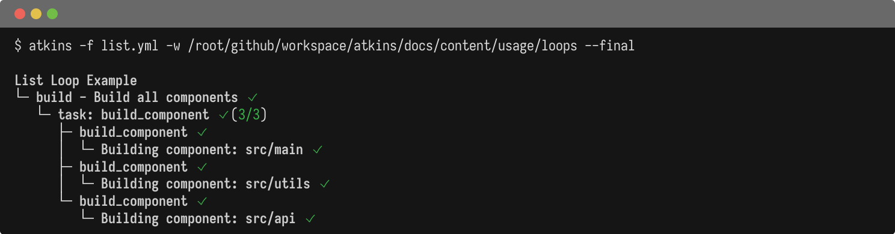
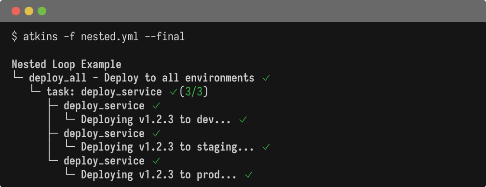
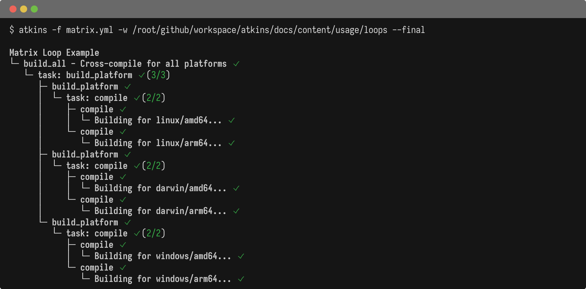
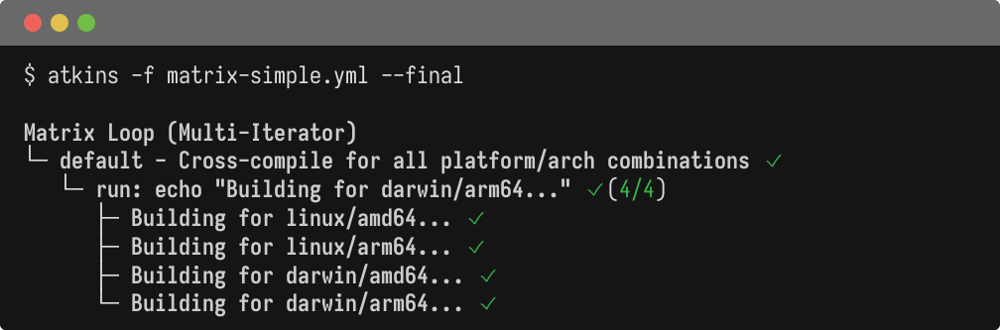

Use `for:` in steps to invoke tasks or run commands repeatedly with different loop variables.

## Examples

@tabs
@file "List Loop" loops/list.yml
@file "Nested Loop" loops/nested.yml
@file "Matrix Loop" loops/matrix.yml
@file "Matrix (Multi-Iterator)" loops/matrix-simple.yml






## How It Works

1. **`for:` in a step** - defines the loop with `for: variable in collection`
2. **`task:` or `run:` in the same step** - the action to perform for each iteration
3. **Loop variable** - becomes available as `${{ variable }}`
4. **`requires:`** - invoked tasks can declare required variables to validate they are present

## Multi-Iterator (Matrix)

Use a list of iterators to create a cartesian product (all combinations):

```yaml
steps:
  - for:
      - goos in ["linux", "darwin"]
      - goarch in ["amd64", "arm64"]
    run: echo "Building ${{ goos }}-${{ goarch }}"
```

This produces 4 iterations: `linux-amd64`, `linux-arm64`, `darwin-amd64`, `darwin-arm64`.

This is similar to GitHub Actions' `matrix` strategy, but more flexible:
- Variables are defined inline or from pipeline vars
- No separate `strategy` block needed
- Works with any step type (`run:`, `task:`, `cmd:`)

## Missing Variables

If a required variable is missing, execution fails with a clear error:

```text
job 'deploy_service' requires variables [env service_version] but missing: [env]
```

## See Also

- [Steps](./steps) - Step configuration
- [Jobs](./jobs) - Job configuration
