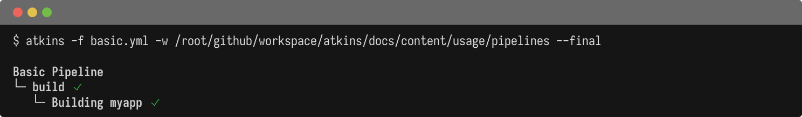

The pipeline is the top-level structure defined in your `atkins.yml` file. It sets the context for all jobs: name, working directory, variables, and environment.

```text
Pipeline (atkins.yml)
├─ Job: build
│  ├─ Step: run tests
│  └─ Step: compile binary
├─ Job: deploy
│  ├─ Step: push image
│  └─ Step: apply config
```

## Pipeline Fields

| Field    | Description                                    |
|----------|------------------------------------------------|
| `name:`  | Pipeline display name                          |
| `dir:`   | Working directory for the pipeline             |
| `vars:`  | Pipeline-level variables available to all jobs |
| `env:`   | Pipeline-level environment variables           |
| `jobs:`  | Job definitions (map of name → job)            |
| `tasks:` | Alias for `jobs:` (Taskfile-style)             |

`jobs:` and `tasks:` are interchangeable. Use whichever style you prefer.

## Examples

@tabs
@file "Basic" pipelines/basic.yml
@file "Complete" pipelines/complete.yml



## See Also

- [Jobs](./jobs) - Job configuration and dependencies
- [Steps](./steps) - Step configuration and loops
- [Configuration](./configuration) - Variables, environment, and syntax
