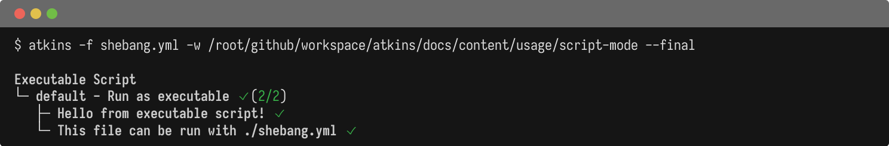

Atkins pipelines can be run as executable scripts or piped via stdin. This lets you treat pipeline files like shell scripts: make them executable, pass arguments, and integrate them into larger toolchains.

This page covers shebang execution, stdin input, and combining script mode with CLI flags.

## Shebang Execution

On Linux and macOS, pipeline files can be made directly executable with a shebang line:

@tabs
@file "Shebang" script-mode/shebang.yml



```bash
chmod +x script.yml
./script.yml
```

Atkins strips the shebang line before parsing, so the file remains valid YAML for other tools.

## Stdin Input

Pipelines can be piped via stdin:

```bash
cat pipeline.yml | atkins
```

Or with a here-doc:

```bash
atkins <<EOF
tasks:
  default:
    steps:
      - run: echo "From stdin"
EOF
```

This is useful for dynamically generated pipelines or quick one-off runs.

## Positional Arguments

A file path can be passed as a positional argument:

```bash
atkins ./ci/build.yml
```

This is equivalent to:

```bash
atkins -f ./ci/build.yml
```

## Combining with Flags

All standard [CLI flags](./cli-flags) work with script mode:

```bash
# Show final tree only
./script.yml --final

# List jobs from an executable pipeline
./script.yml -l

# JSON output from stdin
cat pipeline.yml | atkins --json
```

## See Also

- [CLI Flags](./cli-flags) - Command-line options
- [Automation](./automation) - JSON/YAML output details
