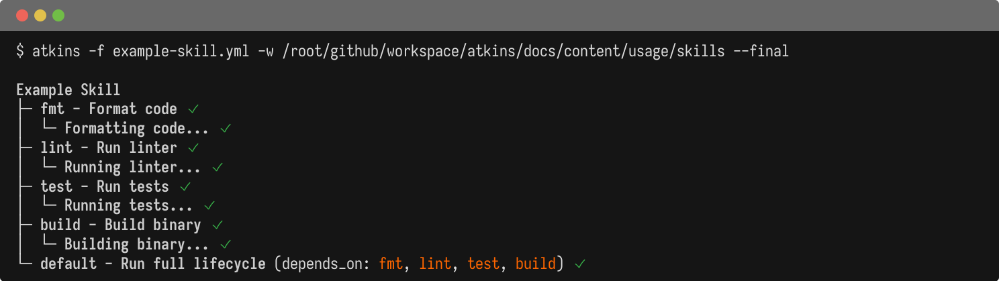

Skills are modular pipeline files that automatically activate based on project context. A Go skill can provide `go:build`, `go:test`, and `go:lint` jobs that appear only when `go.mod` exists in your project. Skills let you build a library of reusable workflows that work across projects without copying configuration.

## Skill Locations

Skills are YAML pipeline files stored in special directories:

- `.atkins/skills/` - Project-local skills
- `$HOME/.atkins/skills/` - Global skills (shared across all projects)

Each skill file becomes a namespace. For example, `go.yml` creates jobs like `go:build`, `go:test`.

### Project Skills

```text
myproject/
├── .atkins/
│   └── skills/
│       ├── go.yml        → go:*
│       ├── docker.yml    → docker:*
│       └── deploy.yml    → deploy:*
└── atkins.yml
```

### Global Skills

```text
$HOME/
└── .atkins/
    └── skills/
        ├── go.yml        → Available in all projects
        └── node.yml      → Available in all projects
```

Project skills take precedence over global skills with the same name.

## Creating a Skill

Skills are YAML pipeline files with a `when:` block for conditional activation:

@tabs
@file "Example Skill" skills/example-skill.yml
@file "When Activation" skills/when-activation.yml



The `when:` block controls when a skill is available. Multiple files use OR logic - any match activates the skill. File patterns search upward from the current directory.

## Skill Namespacing

Skills automatically namespace their jobs:

**go.yml** creates:
- `go:default`
- `go:build`
- `go:test`

Access them with:

```bash
atkins go:build
atkins go:test
```

## Aliases

Skills can provide global aliases that map to namespaced jobs:

```yaml
jobs:
  build:
    aliases: [build, b]
    steps:
      - run: go build
```

Now `atkins build` invokes `go:build`.

### Alias Conflicts

Explicit job aliases take precedence over auto-generated aliases. For example, if a job has `aliases: [go]`, it overrides the automatic `go` → `go:default` mapping.

When multiple skills define the same explicit alias, project skills win over global skills.

To target explicitly:

```bash
atkins :go:build      # Explicit skill reference
atkins :docker:build  # Different skill
```

## Default Jobs

A skill can have a `default` job, enabling shorthand invocation:

```yaml
jobs:
  default:
    depends_on: [lint, test, build]
```

```bash
atkins go        # Runs go:default
```

## Cross-Skill References

Skills can reference each other using `:skill:job` syntax:

**release.yml:**

```yaml
jobs:
  release:
    steps:
      - task: :go:test
      - task: :go:build
      - task: :docker:build
      - task: :docker:push
```

## Skill Variables

Skills can define `vars:` at the pipeline level or job level. These variables are available to all jobs within the skill:

```yaml
name: Docker Skill

vars:
  image: myapp
  registry: docker.io

jobs:
  build:
    steps:
      - run: docker build -t ${{ registry }}/${{ image }} .
```

### Skill Variable Evaluation

When a skill is invoked from another pipeline (e.g., `task: docker:build`), the caller's variable stack carries to the skill. As the execution context already contains `name`, the skill's definition for it is ignored. This allows parameters to come from the execution context, without needing to handle default values when such parameters are omitted in other execution paths.

```yaml
# Caller pipeline (atkins.yml)
vars:
  name: myapp
  semver: v2.0.0

jobs:
  deploy:
    steps:
      - task: docker:build
```

```yaml
# Skill (~/.atkins/skills/docker.yml)
vars:
  name: $(basename $(realpath -s .))    # ignored, caller provides "name"
  semver: $(git tag ... | tail -n 1)    # ignored, caller provides "semver"
  image: titpetric/${{ name }}           # added, resolves to "titpetric/myapp"
```

## Example Skills

### Go Skill

```yaml
name: Go build and test
when:
  files: [go.mod]

vars:
  binary: $(basename $(pwd))

jobs:
  default:
    depends_on: [generate, fmt, lint, test, build]

  generate:
    steps:
      - run: go generate ./...

  fmt:
    steps:
      - run: gofmt -w .
      - run: goimports -w .

  lint:
    steps:
      - run: golangci-lint run

  test:
    aliases: [test]
    steps:
      - run: go test ./...

  build:
    aliases: [build]
    steps:
      - run: go build -o bin/${{ binary }} ./...
```

### Docker Skill

```yaml
name: Docker build and push
when:
  files: [Dockerfile]

vars:
  image: $(basename $(pwd))
  tag: $(git describe --tags --always)

jobs:
  build:
    aliases: [docker]
    steps:
      - run: docker build -t ${{ image }}:${{ tag }} .

  push:
    steps:
      - run: docker push ${{ image }}:${{ tag }}
```

### Node.js Skill

```yaml
name: Node.js
when:
  files: [package.json]

jobs:
  install:
    steps:
      - run: npm install

  build:
    depends_on: [install]
    steps:
      - run: npm run build

  test:
    depends_on: [install]
    aliases: [test]
    steps:
      - run: npm test
```

## Workspace Skills

A workspace skill in `[project]/.atkins/skills/` applies to the entire project.

**With `when:`** - working directory is set to the folder containing the matched file.

**Without `when:`** - working directory is set to the folder containing `.atkins/`. This allows the skill to run project-level commands from the workspace root.

### Global Skill Behavior

Global skills in `~/.atkins/skills/` are available everywhere without populating your source tree.

Global skills do not change the working directory. They run from wherever you invoke atkins, unless:

- They have a `when:` that matches a file (uses that file's folder)
- They explicitly set `dir:` in the pipeline

### Project Structure

The main pipeline and `.atkins/` folder define workspace boundaries:

```
/project/.atkins/          # workspace skills
/project/atkins.yml        # main pipeline
/project/app/compose.yml   # matched by compose skill
/project/app/sub/          # can invoke skills from here
```

From `/project/app/sub/`, atkins searches upward to find configuration and skills. A compose skill with `when: files: [compose.yml]` would match `/project/app/compose.yml` and run from `/project/app/`.

Nested `.atkins/` folders or pipelines create separate workspaces with their own scope.

## Jail Mode

To disable global skills:

```bash
atkins --jail
```

This only loads skills from `.atkins/skills/`, ignoring `$HOME/.atkins/skills/`.

Useful for:
- Reproducible CI builds
- Avoiding personal customizations
- Testing project-only configurations

## Listing Skills

View all active skills and their jobs:

```bash
atkins -l
```

Output shows skills after the main pipeline:

```
My Project

* default:    Run all
* build:      Build app

Aliases

* go:         (invokes: go:default)
* test:       (invokes: go:test)

Go build and test

* go:default: Go lifecycle
* go:build:   Build binary
* go:test:    Run tests
```

## See Also

- [Configuration](./configuration) - Pipeline format details
- [Job Targeting](./job-targeting) - Running specific jobs
