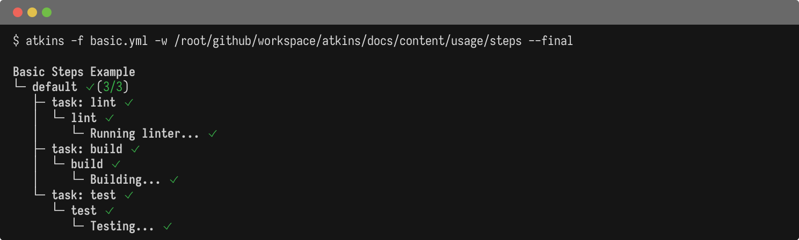

Steps are the individual commands or actions within a job. They execute sequentially by default.

## Step Fields

| Field               | Description                                                  |
|---------------------|--------------------------------------------------------------|
| `run:`              | Shell command to execute                                     |
| `cmd:`              | Alias for `run:`                                             |
| `cmds:`             | List of commands (run sequentially)                          |
| `task:`             | Invoke another job/task by name                              |
| `name:`             | Display name for the step                                    |
| `if:`               | Conditional execution (string or list; list items are ANDed) |
| `for:`              | Loop iteration (`for: item in collection`)                   |
| `dir:`              | Working directory                                            |
| `detach: true`      | Run step in background                                       |
| `deferred: true`    | Run after other steps complete                               |
| `defer:`            | Shorthand for a deferred step                                |
| `verbose: true`     | Show more output                                             |
| `passthru: true`    | Output with tree indentation                                 |
| `tty: true`         | Allocate a PTY for color output                              |
| `interactive: true` | Live streaming with stdin                                    |
| `vars:`             | Step-level variables                                         |
| `env:`              | Step-level environment variables                             |

## Examples

@tabs
@file "Basic" steps/basic.yml
@file "Deferred" steps/deferred.yml
@file "For Loop" steps/for-loop.yml

See [Loops](./loops) for advanced loop patterns.

## See Also

- [Pipelines](./pipelines) - Pipeline-level configuration
- [Jobs](./jobs) - Job configuration and dependencies
- [Loops](./loops) - For loop details
- [Conditionals](./conditionals) - Conditional execution
